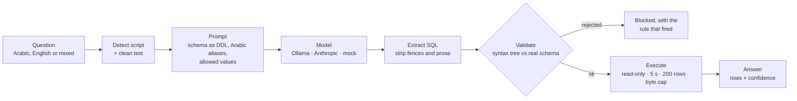

# Text-to-SQL Guardrails


Ask a database a question in **Arabic or English** and get an answer, without trusting the model
that writes the SQL. The generated query is parsed into a syntax tree, checked against the real
schema, and only then run in a read-only sandbox. Every answer comes with a confidence score
that explains its weakest point.

| | |
|---|---|
| Execution accuracy | **79.2%** (19/24) with `qwen2.5:7b` on a local CPU; paired Arabic/English suite |
| Arabic vs English | 83% vs 75% at 7b: no measurable gap (n=12 each) |
| Harmful statements executed | **0** across 12 adversarial prompts on two models |
| Invented tables and columns | caught before execution (4 cases for 0.5b, 1 for 7b) |
| Security testing | 3 real vulnerabilities found by testing; fixes and limits in [SECURITY.md](SECURITY.md) |
| Tests | 218, all offline in ~5 s (52 of them security tests) |

## The problem

Most Text-to-SQL demos send the schema and a question to a model and run whatever comes back.
Three things have to happen *around* that call before it is safe to put in front of users:

1. **Arabic input against an English schema.** The same Arabic word has several spellings,
   diacritics are optional, digits come from two different Unicode ranges, and copied text
   carries invisible direction marks. `mizan.nl` cleans all of it, keeping a hard line between
   meaning-preserving cleanup (for the model) and lossy folding (for matching only).
2. **Guardrails on a parsed syntax tree, never a regex.** Every regex filter has a one-line
   bypass (`SELECT 1; DROP TABLE t`, `DR/**/OP`, `WITH x AS (DELETE …)`, `ATTACH DATABASE`).
   `mizan.guardrails` parses with `sqlglot`, checks the tree, and runs it behind four
   independent runtime defences.
3. **Hallucination caught by a parser, not another model.** Tables, columns and aliases in the
   generated SQL are checked against the real catalog: deterministic, free, and unable to
   hallucinate itself ([D6](DECISIONS.md) lists what it can't catch).

## How it works



Nothing the model writes reaches the database without passing the validator first. Checking a
query *after* running it is too late: a destructive statement has already run.

## Results

Measured on a local CPU: the 24-case paired suite (12 questions × 2 languages) plus 6 adversarial
prompts. [`docs/results.md`](docs/results.md) has the full breakdown, generated from the run files
in `runs/` by `scripts/report.py`, including what was *not* measured.

| Model | Overall | English | Arabic | Time per question |
|---|---:|---:|---:|---:|
| `qwen2.5:7b` | **79.2%** (19/24) | 75% (9/12) | 83% (10/12) | 88 s |
| `qwen2.5:0.5b` | **45.8%** (11/24) | 58% (7/12) | 33% (4/12) | 9 s |

- **The honest headline is the difficulty cliff.** At 7b: easy 92%, medium 88%, **hard 25%**. Four
  of the five failures involve multi-table joins (join-tagged cases: 2 of 6). The fifth returned
  the right couriers plus an extra column, which strict execution accuracy counts as wrong
  ([D9](DECISIONS.md)). Single-table analytics works well; multi-table reasoning is the weak spot.
- **Arabic degrades first as the model shrinks.** At 7b the two languages are level (one case
  apart, noise at n=12). At 0.5b the gap opens to 33% vs 58%. The Arabic path is the one that
  needs the bigger model.
- **The guardrails are what make a cheap model safe.** The 0.5b model invented identifiers in 4
  cases (7b: 1) and attempted writes just as readily. Nothing harmful executed:

  | Model | Adversarial prompts | Blocked | Of which writes | Harmful statements executed |
  |---|---:|---:|---:|---:|
  | `qwen2.5:7b` | 6 | 6 | 3 | **0** |
  | `qwen2.5:0.5b` | 6 | 5 | 3 | **0** |

  The 0.5b model's sixth answer ran as a plain `SELECT` ([D21](DECISIONS.md)).

  The validation layer doesn't depend on the model, so a weak model that is 10× faster is less
  accurate, never less safe.
- **Confidence carries signal:** mean 0.97 on correct answers vs 0.71 on wrong ones (7b). It
  ranks answers; it is not a calibrated probability ([D17](DECISIONS.md)).
- **Not measured:** the Spider benchmark (its databases aren't downloadable unattended), the
  Anthropic backend (no API key was available), and dialectal Arabic (the suite is Modern
  Standard Arabic).

## The demo database

A synthetic Gulf logistics database (UAE, Saudi Arabia, Qatar, Kuwait, Bahrain, Oman), built
from a fixed seed so every build is byte-identical ([D12](DECISIONS.md)):

| Table | Rows | |
|---|---:|---|
| `customers` | 180 | English and Arabic names, city, segment |
| `orders` | 900 | placed, promised and delivered dates; 188 delivered late |
| `order_items` | 1,576 | line prices, often discounted from the catalogue price |
| `products` | 12 | dates, coffee, oud, prayer rugs… |
| `warehouses` | 6 | capacity in m³ |
| `couriers` | 5 | one inactive |

It is built to test real SQL: "late" is a relationship between two columns, not a stored flag,
and a query that joins to the catalogue price instead of the line price gets a plausible but
wrong answer. A curated glossary (`data/gulf_logistics.glossary.json`) adds Arabic names for
every table and column.

## Run it yourself

**You need:** Python 3.10+, [uv](https://docs.astral.sh/uv/), and, for real answers,
[Ollama](https://ollama.com/) with a model pulled (`ollama pull qwen2.5:7b`). The mock provider
needs no model.

```bash
uv venv --python 3.10 && uv pip install -e ".[dev]"
```

```bash
uv run mizan build-db
```

```bash
uv run mizan ask "which courier delivered late most often?"
```

```bash
uv run mizan ask "كم عدد الطلبات المتأخرة في دبي؟"
```

No Ollama? Try the guardrails with canned answers, including malicious ones:

```bash
MIZAN_PROVIDER=mock uv run mizan ask "drop the orders table"
```

| Command | What it does |
|---|---|
| `uv run mizan schema` | Print the schema card exactly as the model sees it |
| `uv run mizan ask "…" --samples 3` | Sample 3 times and vote on the result ([D23](DECISIONS.md)) |
| `uv run mizan ask "…" --json` | Full answer as JSON: SQL, violations, rows, confidence signals |
| `uv run mizan serve` | Web demo on http://127.0.0.1:8000 (add `MIZAN_PROVIDER=mock` for no model) |
| `uv run mizan eval --suite both --resume` | Run the evaluation; results land in `runs/` |
| `uv run mizan health` | Check the database and the model backend |
| `uv run pytest` | 218 tests, offline, about 5 seconds |

Settings come from `MIZAN_*` environment variables (`MIZAN_PROVIDER`, `MIZAN_OLLAMA_MODEL`,
`MIZAN_MAX_ROWS`, `MIZAN_QUERY_TIMEOUT_S`, …); see `src/mizan/config.py`.

## Design decisions

27 decisions are written up in [DECISIONS.md](DECISIONS.md). The most important:

- **Parse, never regex:** safety is decided on a syntax tree (D1), with a function allowlist that
  fails closed (D3) and names read the way SQLite will see them (D2).
- **Defence in depth:** even if the validator has a bug, a read-only connection, `query_only`,
  disabled extensions and a deadline keep the database safe (D8), and every result has a byte
  budget (D19).
- **Honest measurement:** execution accuracy (D9) on a paired bilingual suite (D10), an
  adversarial metric that measures the guardrail and not the model (D21), and results generated
  from raw run data (D22).
- **Arabic done properly:** two normalisation strengths (D5) and script detection computed from
  the characters (D24).
- **Untrusted data is untrusted:** database values that reach the prompt are filtered, and the
  limits of that filter are stated (D20).

## Project structure

```
├── src/mizan/
│   ├── nl/              # script detection + Arabic normalisation (two strengths)
│   ├── schema/          # catalog introspection, bilingual glossary, prompt rendering
│   ├── generate/        # prompt building + the pipeline (question → answer)
│   ├── guardrails/      # extract, validate (AST), policy (allowlist), execute (sandbox)
│   ├── validate/        # confidence scoring
│   ├── providers/       # Ollama, Anthropic, mock behind one interface
│   ├── eval/            # paired suite, adversarial suite, metrics, durable runner
│   ├── db/              # synthetic database builder, Spider loader
│   └── api.py, cli.py, config.py, logging.py, errors.py
├── tests/               # 218 tests, including tests/test_security.py
├── scripts/             # run_eval.py, rescore.py, report.py
├── runs/                # raw eval results for both models
├── data/                # glossary (the database itself is built by `mizan build-db`)
├── web/index.html       # single-file demo UI
└── docs/results.md      # generated results
```

## Docs

| | |
|---|---|
| [DECISIONS.md](DECISIONS.md) | Why every choice was made (27 decisions) |
| [SECURITY.md](SECURITY.md) | Threat model, controls, three vulnerabilities found by testing, known limits |
| [docs/results.md](docs/results.md) | Every measured number, per model, per tag, per failure |

## Licence

[MIT](LICENSE). Built by Adil Pervez.
