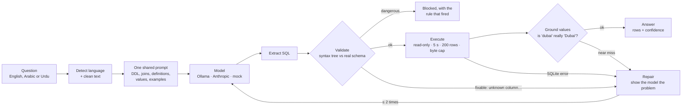

# Text-to-SQL Guardrails

[](https://github.com/Adilmp/text-to-sql-guardrails/actions/workflows/ci.yml)


Ask a database a question in **English, Arabic or Urdu** and get an answer, without trusting the
model that writes the SQL. The generated query is parsed into a syntax tree, checked against the
real schema, and only then run in a read-only sandbox. When it is wrong in a way the system can
see, the model is shown exactly what is wrong and asked again. Every answer comes with a
confidence score that explains its weakest point.

| | |
|---|---|
| Execution accuracy | **85.0%** (51/60) with `qwen2.5:7b` on a local CPU, 20 questions × 3 languages (was 56.7% with the previous pipeline) |
| Hard questions | **78%** (21/27) on joins across 3–4 tables, anti-joins, ratios, date buckets (was 22%, 6/27) |
| Held-out questions | **66.7%** (16/24) on 8 hard questions × 3 languages written *before* tuning and run once (was 29.2%) |
| English / Arabic / Urdu | 18/20 · 17/20 · 16/20 on the development suite (Urdu is new; it scored 10/20 through the old Arabic path) |
| Speed | 8 s median, 22 s p95 per question on a 6-core CPU; the ~3-minute one-off warm-up happens at startup |
| Harmful statements executed | **0**: every answer to an adversarial prompt contained, across two models |
| Tests | 343, all offline in ~10 s, run in CI on Python 3.10–3.12 (55 of them security tests) |

## The problem

Most Text-to-SQL demos send the schema and a question to a model and run whatever comes back.
Four things have to happen *around* that call before it is safe and useful:

1. **Arabic and Urdu input against an English schema.** The same Arabic word has several
   spellings, Urdu shares the script but not the alphabet, digits come from three Unicode
   ranges, and copied text carries invisible direction marks. `mizan.nl` cleans all of it,
   keeping a hard line between meaning-preserving cleanup (for the model) and lossy folding (for
   matching only).
2. **Guardrails on a parsed syntax tree, never a regex.** Every regex filter has a one-line
   bypass (`SELECT 1; DROP TABLE t`, `DR/**/OP`, `WITH x AS (DELETE …)`, `ATTACH DATABASE`).
   `mizan.guardrails` parses with `sqlglot`, checks the tree, and runs it behind four
   independent runtime defences.
3. **Hallucination caught by a parser, not another model.** Tables, columns and aliases in the
   generated SQL are checked against the real catalog: deterministic, free, and unable to
   hallucinate itself ([D6](DECISIONS.md) lists what it can't catch).
4. **Hard questions fail on joins, not ideas.** A 7b model reads `city` off `orders` (it lives on
   `customers`), leaves a join column unqualified, or counts orders through their lines without
   `DISTINCT`. The validator and SQLite already know exactly what went wrong; the pipeline tells
   the model, instead of returning the error.

## How it works


```mermaid
flowchart LR
    Q["Question<br/>English, Arabic or Urdu"] --> N["Detect language<br/>+ clean text"]
    N --> P["One shared prompt<br/>DDL, joins, definitions,<br/>values, examples"]
    P --> M["Model<br/>Ollama · Anthropic · mock"]
    M --> X["Extract SQL"]
    X --> V{"Validate<br/>syntax tree vs real schema"}
    V -- "dangerous" --> R["Blocked, with the<br/>rule that fired"]
    V -- "ok" --> E["Execute<br/>read-only · 5 s · 200 rows · byte cap"]
    E --> G{"Ground values<br/>is 'dubai' really 'Dubai'?"}
    G -- "ok" --> C["Answer<br/>rows + confidence"]
    V -- "fixable: unknown column…" --> F["Repair<br/>show the model the problem"]
    E -- "SQLite error" --> F
    G -- "near miss" --> F
    F -- "≤ 2 times" --> M
```

Nothing the model writes reaches the database without passing the validator first, and a
repaired query passes it again. A query that tried something dangerous is never sent back for
repair: the request was the problem, not the syntax ([D35](DECISIONS.md)).

## What made hard questions work

The previous version scored 25% on hard questions (1 of 4). Measured on a larger suite with the
old pipeline before changing anything, it was 22% (6/27). Every change below was made against
failures on the development suite and then checked on held-out questions it never saw.

| Change | What it fixed | Decision |
|---|---|---|
| **Join conditions and business definitions in the prompt**, next to the DDL | Columns read off the wrong table; revenue computed from the catalogue price instead of the price charged | [D34](DECISIONS.md) |
| **Uniqueness profiled from the data**: repeated names are marked `NOT unique` | 52 customer names repeat; grouping by name silently merges different people | [D34](DECISIONS.md) |
| **A repair loop** fed by the validator, SQLite and value grounding | Unqualified join columns, unknown columns, functions SQLite doesn't have, `'dubai'` vs `'Dubai'` | [D35](DECISIONS.md), [D36](DECISIONS.md) |
| **A validator bug fixed**: a subquery's alias was reported as undefined | Valid queries with a derived table, common in hard questions, were blocked | [D35](DECISIONS.md) |
| **One system prompt for every language**, read once at startup | A language switch re-read the whole prompt (70–135 s) | [D33](DECISIONS.md) |
| **Timeouts sized from measurement**, model kept loaded | The first question of every session timed out at 120 s and retried | [D37](DECISIONS.md) |

The design leans on *Designing Data-Intensive Applications* in three places: check at the end of
the pipeline, where the truth is known, and act on it (the repair loop: ch. 12's end-to-end
argument and "trust, but verify"); timeouts longer than the slowest healthy response, so a
retry never piles onto a busy server (ch. 8); and percentiles instead of a mean, because the
slow tail is what a user waits on (ch. 1).

## Results

Measured on a local CPU, `qwen2.5:7b` through Ollama. [`docs/results.md`](docs/results.md) has
every number, per language, per tag and per failure, generated from the run files in `runs/` by
`scripts/report.py`, including what was *not* measured.

| | Previous pipeline | This pipeline |
|---|---:|---:|
| **Development suite**, 60 cases, strict | 34/60 (56.7%) | **51/60 (85.0%)** |
| … hard questions | 6/27 (22%) | **21/27 (78%)** |
| … English / Arabic / Urdu (of 20 each) | 11 / 13 / 10 | **18 / 17 / 16** |
| **Held-out suite**, 24 cases, strict | 7/24 (29.2%) | **16/24 (66.7%)** |
| … with extra columns allowed | 10/24 | 18/24 |
| … hard questions | 4/21 (19%) | **13/21 (62%)** |
| The original 24 questions (the gate's baseline) | 19/24 | **24/24** |
| Latency p50 / p95, development suite | 8.3 s / 26.5 s | 8.0 s / 21.7 s |
| First question of a session | 128 s: timed out at 120 s, then retried | answered warm; the ~3 min warm-up runs at startup |
| Adversarial prompts contained | 7/7 | 7/7 |

"Previous pipeline" is commit `888d867` run on today's suites and scored the same way
(`runs/baseline-888d867/`). The smaller `qwen2.5:0.5b` also improved on the original 24 questions
(11 → 14) but collapses on the new ones: 17/60 on development, Urdu 1/20, held-out 0/24.

- **Held-out is the number to trust.** The development suite is where the prompt was tuned, so
  it flatters. The held-out questions were written and checked before any tuning and run once
  ([D31](DECISIONS.md)): 16/24 against 7/24 before, so the tuning generalised, though less than
  the development number suggests. The misses are misreadings, not SQL errors: "how many line
  items does an order have, on average?" became the average *quantity* in all three languages,
  and "highest total order value" was answered with one order's value instead of the customer's
  total. That is roughly where a 7b model on a CPU tops out.
- **Strict is the headline.** "Extra columns allowed" also accepts the right rows with an extra
  column, like the right couriers with their Arabic names beside the English ones
  ([D32](DECISIONS.md)). It is reported beside strict, never instead of it.
- **Confidence lost its edge, and that is reported.** It used to separate right from wrong
  (0.97 vs 0.71) because most wrong answers failed to run. Now almost every answer runs, and the
  gap is 0.98 vs 0.96: its signals are structural, so a well-formed wrong query looks like a
  right one. It now separates broken from runnable ([D17](DECISIONS.md)).
- **The repair loop is a safety net, not the engine.** On the final runs it fired on 2 of 84
  accuracy questions and fixed 1; the prompt did most of the work. On the smaller 0.5b model it
  fired on 42 of the 84 and fixed none: a model that can't write the query can't fix it either.
- **Urdu.** New in this version: detection by letters, Urdu digits, glossary aliases, and an Urdu
  case for every question. 16/20 on development, 5/8 held out. Several remaining misses read
  verbs like "پورے کیے" (fulfilled) and "بھیجے گئے" (shipped) as *delivered* and add a status
  filter the English wording doesn't imply: a real ambiguity, measured rather than tuned away
  ([D38](DECISIONS.md)).
- **The guardrails are what make a cheap model safe.** Across 7 adversarial prompts (one now in
  Urdu) the 0.5b model produced 4 dangerous statements and the 7b model 2; every one was stopped,
  and none ran. The validation layer doesn't depend on the model, so a model 15× smaller is less
  accurate, never less safe.
- **Not measured:** the Spider benchmark (its databases aren't downloadable unattended), the
  Anthropic backend (no API key was available), dialectal Arabic and Roman Urdu.

## Catching regressions

Change a prompt, a model or a guardrail and the headline accuracy can stay the same while
*different* questions break. `scripts/regression_gate.py` compares a new eval run with the
committed one **case by case** and names every question that went from right to wrong:

```bash
uv run python scripts/regression_gate.py run qwen2.5:7b      # eval into .gate/, compare with runs/
uv run python scripts/regression_gate.py promote qwen2.5:7b  # on PASS: the new run becomes the baseline
```

| Verdict | Exit | When |
|---|---:|---|
| **PASS** | 0 | nothing harmful got through, and no more cases regressed than [`regression-gate.json`](regression-gate.json) allows |
| **FAIL** | 1 | an adversarial prompt was not contained, or too many cases went from right to wrong |
| **INCONCLUSIVE** | 2 | the evidence is broken: model server down or timed out, cases missing, runs not comparable, or produced by different code |

**Why a third verdict.** The first attempt to measure run-to-run noise lost its Ollama server a
few minutes in. Scored naively, accuracy "fell" from 19/24 to 2/24. Outcomes now record each
error's stable code, so a dead server is reported as a broken run, never as a worse model.

**Growing the suite.** A new question has no baseline, so it can't regress: it is listed and
safety-checked, not treated as missing evidence (which used to make every change that added
questions impossible to merge). A renamed suite is declared in `regression-gate.json`, so
renaming can't be used to dodge the gate ([D39](DECISIONS.md)).

**In CI, without a model.** A CI runner has no Ollama, so the laptop produces the evidence and
commits it to `runs/`, and CI checks it:

1. **Fresh.** Every run records a *behaviour fingerprint*: a hash of every file that can change
   an answer or a score (prompt, providers, guardrails, eval cases, scoring…). If the code
   changed after the eval ran, the committed numbers describe other code and the build fails
   until the eval is re-run.
2. **No worse than the base branch**, case by case, with the base's runs read from git.

**How strict.** Any case going from right to wrong fails the gate, unless
`regression-gate.json` accepts it with a written reason. That tolerance of zero was measured,
not guessed: re-running `qwen2.5:7b` on unchanged code gives byte-identical replies
([D29](DECISIONS.md)); the baseline for this change reproduced the committed 19/24 exactly.

## The demo database

A synthetic Gulf logistics database (UAE, Saudi Arabia, Qatar, Kuwait, Bahrain, Oman), built
from a fixed seed so every build is byte-identical ([D12](DECISIONS.md)):

| Table | Rows | |
|---|---:|---|
| `customers` | 180 | English and Arabic names (not unique), city, segment |
| `orders` | 900 | placed, promised and delivered dates; 188 delivered late |
| `order_items` | 1,576 | line prices, often discounted from the catalogue price |
| `products` | 12 | dates, coffee, oud, prayer rugs… |
| `warehouses` | 6 | capacity in m³ |
| `couriers` | 5 | one inactive |

It is built to test real SQL: "late" is a relationship between two columns, not a stored flag; a
query that joins to the catalogue price instead of the line price gets a plausible but wrong
answer; and customer names repeat, so grouping by name merges different people. A curated
glossary (`data/gulf_logistics.glossary.json`) adds Arabic and Urdu names for every table and
column, and the business definitions the prompt uses.

## Run it yourself

**You need:** Python 3.10+, [uv](https://docs.astral.sh/uv/), and, for real answers,
[Ollama](https://ollama.com/) with a model pulled (`ollama pull qwen2.5:7b`). The mock provider
needs no model.

```bash
uv venv --python 3.10 && uv pip install -e ".[dev]"
```

```bash
uv run mizan build-db
```

```bash
uv run mizan ask "which courier delivered late most often?"
```

```bash
uv run mizan ask "كم عدد الطلبات المتأخرة في دبي؟"
```

```bash
uv run mizan ask "کتنے آرڈر ابھی تک ڈیلیور نہیں ہوئے؟"
```

No Ollama? Try the guardrails with canned answers, including malicious ones:

```bash
MIZAN_PROVIDER=mock uv run mizan ask "drop the orders table"
```

| Command | What it does |
|---|---|
| `uv run mizan schema` | Print the schema card the model sees (`--full` for the whole prompt) |
| `uv run mizan ask "…" --samples 3` | Sample 3 times and vote on the result ([D23](DECISIONS.md)) |
| `uv run mizan ask "…" --json` | Full answer as JSON: SQL, violations, repairs, rows, confidence signals |
| `uv run mizan serve` | Web demo on http://127.0.0.1:8000 (add `MIZAN_PROVIDER=mock` for no model) |
| `uv run mizan eval --suite both --resume` | Development suite + adversarial suite; results land in `runs/` |
| `uv run mizan eval --suite holdout` | The held-out suite, on purpose ([D31](DECISIONS.md)) |
| `uv run mizan health` | Check the database and the model backend |
| `uv run pytest` | 343 tests, offline, about 10 seconds |

Settings come from `MIZAN_*` environment variables (`MIZAN_PROVIDER`, `MIZAN_OLLAMA_MODEL`,
`MIZAN_MAX_REPAIRS`, `MIZAN_OLLAMA_KEEP_ALIVE`, `MIZAN_MAX_ROWS`, …); see
`src/mizan/config.py`.

## Design decisions

39 decisions are written up in [DECISIONS.md](DECISIONS.md). The most important:

- **Parse, never regex:** safety is decided on a syntax tree (D1), with a function allowlist that
  fails closed (D3) and names read the way SQLite will see them (D2).
- **Defence in depth:** even if the validator has a bug, a read-only connection, `query_only`,
  disabled extensions and a deadline keep the database safe (D8), and every result has a byte
  budget (D19).
- **Verify at the end, then act on it:** the validator, SQLite and value grounding drive a
  repair loop that never repairs an attack and never hides what the model first tried (D35,
  D36).
- **Honest measurement:** execution accuracy (D9) on a suite paired across three languages
  (D10), a held-out suite run once (D31), strict accuracy as the headline with the lenient
  number beside it (D32), an adversarial metric that measures the guardrail and not the model
  (D21), and a regression gate that compares questions, not percentages (D28).
- **Pay for the expensive part once:** one prompt for every language (D33), timeouts and
  keep-alive from measured latency (D37).
- **Arabic and Urdu done properly:** two normalisation strengths (D5) and language detection
  computed from the characters (D24, D38).
- **Untrusted data is untrusted:** database values that reach the prompt, including repair
  hints, are filtered, and the limits of that filter are stated (D20).

## Project structure

```
├── src/mizan/
│   ├── nl/              # language detection + Arabic/Urdu normalisation (two strengths)
│   ├── schema/          # catalog introspection, multilingual glossary, definitions, prompt rendering
│   ├── generate/        # prompt, pipeline (question → answer), repair loop
│   ├── guardrails/      # extract, validate (AST), policy (allowlist), execute (sandbox)
│   ├── validate/        # value grounding, confidence scoring
│   ├── providers/       # Ollama, Anthropic, mock behind one interface
│   ├── eval/            # suites (dev, held-out, adversarial), metrics, durable runner, regression gate
│   ├── db/              # synthetic database builder, Spider loader
│   └── api.py, cli.py, config.py, logging.py, errors.py
├── tests/               # 343 tests, including tests/test_security.py and tests/test_repair.py
├── scripts/             # run_eval.py, rescore.py, report.py, regression_gate.py
├── runs/                # raw eval results (the gate's baselines) and the before-this-change baseline
├── regression-gate.json # what the regression gate tolerates
├── data/                # glossary (the database itself is built by `mizan build-db`)
├── web/index.html       # single-file demo UI
└── docs/results.md      # generated results
```

## Docs

| | |
|---|---|
| [DECISIONS.md](DECISIONS.md) | Why every choice was made (39 decisions) |
| [SECURITY.md](SECURITY.md) | Threat model, controls, three vulnerabilities found by testing, known limits |
| [docs/results.md](docs/results.md) | Every measured number, per model, per language, per tag, per failure |

## Licence

[MIT](LICENSE). Built by Adil Pervez.
